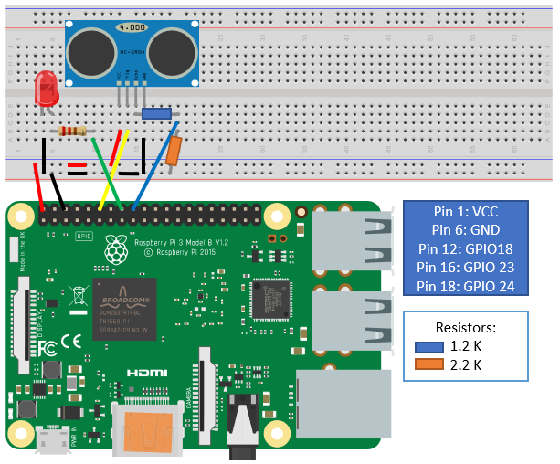

# ultra-wookie

I am using a RaspberryPi 3B+ and a ultrasonic sensor HC-SR04

For this project I also need a led and a resistor (use from 220ohm to 1K depending on what you have at hand, anything in between will work but the led will be brighter at lower resistance (ohm's law)).  

